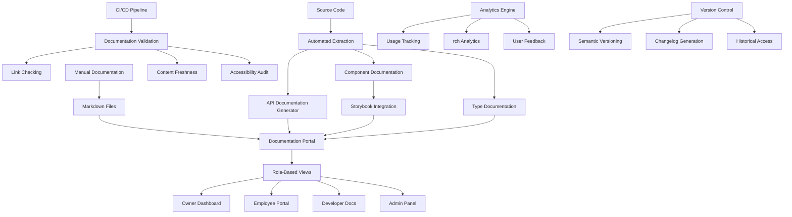

# Documentation System Design

## Overview

The documentation system will create a comprehensive, multi-layered documentation architecture that serves developers, business users, and system administrators. The system leverages existing tools like Storybook for component documentation, integrates with the Next.js application structure, and provides role-based documentation access through a dedicated documentation portal.

The design follows a hub-and-spoke model where a central documentation portal (`/app/documentation`) serves as the entry point, with specialized documentation sections for different user roles and technical areas. The system will use automated generation where possible and maintain consistency through standardized templates and formatting.

## Architecture

### Documentation Portal Structure

```
/app/documentation/
├── index.tsx                    # Main documentation hub
├── developer/                   # Developer documentation
│   ├── setup/                  # Environment setup guides
│   ├── api/                    # API documentation
│   ├── components/             # Component library docs
│   ├── testing/                # Testing guides
│   └── contributing/           # Contribution guidelines
├── business/                   # Business user documentation
│   ├── owner/                  # Salon owner guides
│   ├── employee/               # Employee operational guides
│   └── customer/               # Customer-facing guides
├── admin/                      # System administrator docs
│   ├── deployment/             # Deployment and configuration
│   ├── monitoring/             # System monitoring
│   └── maintenance/            # Maintenance procedures
└── shared/                     # Shared resources
    ├── glossary/               # Terms and definitions
    ├── troubleshooting/        # Common issues and solutions
    └── changelog/              # Version history and updates
```

### Documentation Generation Pipeline



### Integration Points

- **Storybook**: Component documentation and design system
- **Next.js App Router**: Documentation portal routing
- **Payload CMS**: Content management for business documentation
- **TypeScript**: Automated type documentation generation
- **API Routes**: Automated API documentation extraction
- **Git Hooks**: Documentation validation and updates
- **CI/CD Pipeline**: Automated testing, validation, and deployment
- **Analytics Engine**: Usage tracking and content optimization
- **rch Engine**: Full-text rch with Algolia or Elasticrch
- **Notification System**: Content update alerts and user notifications

### CI/CD Integration

#### Automated Documentation Pipeline

```typescript
interface DocumentationPipeline {
  triggers: {
    onPullRequest: ValidationStep[];
    onMerge: DeploymentStep[];
    onSchedule: MaintenanceStep[];
  };
  validation: {
    linkChecking: boolean;
    codeExampleTesting: boolean;
    accessibilityAudit: boolean;
    contentFreshness: boolean;
    spellCheck: boolean;
  };
  deployment: {
    stagingPreview: boolean;
    productionDeploy: boolean;
    cacheInvalidation: boolean;
    rchIndexUpdate: boolean;
  };
}
```

#### Content Automation

````typescript
interface ContentAutomation {
  apiDocGeneration: {
    source: 'openapi' | 'code-analysis'
    outputFormat: 'markdown' | 'json' | 'html'
    includeExamples: boolean
  }
  changelogGeneration: {
    source: 'git-commits' | 'pull-requests'
    semanticVersioning: boolean
    categorization: boolean
  }
  contentRecommendations: {
    crossLinking: boolean
    relatedContent: boolean
    userPersonalization: boolean
  }
}

## Components and Interfaces

### Core Documentation Components

#### DocumentationLayout Component
```typescript
interface DocumentationLayoutProps {
  children: React.ReactNode
  sidebar: SidebarConfig
  breadcrumbs: BreadcrumbItem[]
  userRole: UserRole
}
````

#### Documentationrch Component

```typescript
interface DocumentationrchProps {
  onrch: (query: string) => void;
  filters: rchFilter[];
  placeholder: string;
  fuzzyrch: boolean;
  synonyms: Record<string, string[]>;
  rchRanking: rchRankingConfig;
  analytics: rchAnalytics;
}

interface rchRankingConfig {
  roleBasedBoost: Record<UserRole, number>;
  recencyBoost: number;
  popularityBoost: number;
  accuracyBoost: number;
}

interface rchAnalytics {
  trackQuery: (query: string, results: number) => void;
  trackClick: (query: string, resultId: string) => void;
  trackNoResults: (query: string) => void;
}
```

#### GuideRenderer Component

```typescript
interface GuideRendererProps {
  content: MarkdownContent;
  interactive: boolean;
  stepByStep: boolean;
  userRole: UserRole;
}
```

#### APIDocumentation Component

```typescript
interface APIDocumentationProps {
  endpoints: APIEndpoint[];
  authentication: AuthConfig;
  examples: CodeExample[];
  interactiveTesting: boolean;
  sdkGeneration: SDKGenerationConfig;
  openApiSpec?: OpenAPISpec;
}

interface SDKGenerationConfig {
  languages: ("typescript" | "python" | "curl" | "javascript")[];
  includeAuth: boolean;
  baseUrl: string;
}
```

### Enhanced Documentation Components

#### FeedbackWidget Component

```typescript
interface FeedbackWidgetProps {
  contentId: string;
  contentType: "guide" | "api" | "component";
  onFeedback: (feedback: UserFeedback) => void;
  showRating: boolean;
  showComments: boolean;
}

interface UserFeedback {
  rating: number;
  comment?: string;
  helpful: boolean;
  suggestions?: string;
  userRole: UserRole;
}
```

#### AnalyticsDashboard Component

```typescript
interface AnalyticsDashboardProps {
  timeRange: DateRange;
  metrics: DocumentationMetrics;
  userRole: "admin" | "content_manager";
}

interface DocumentationMetrics {
  totalViews: number;
  uniqueUsers: number;
  rchQueries: rchMetric[];
  popularContent: ContentMetric[];
  userSatisfaction: SatisfactionMetric[];
  contentGaps: ContentGap[];
}
```

#### VersionHistory Component

```typescript
interface VersionHistoryProps {
  contentId: string;
  versions: DocumentationVersion[];
  onVersionSelect: (version: string) => void;
  showDiff: boolean;
}

interface DocumentationVersion {
  version: SemanticVersion;
  releaseDate: Date;
  changes: ChangeItem[];
  author: string;
  migrationGuide?: string;
}
```

### Documentation Data Interfaces

#### DocumentationSection

```typescript
interface DocumentationSection {
  id: string;
  title: string;
  description: string;
  userRoles: UserRole[];
  subsections: DocumentationSubsection[];
  lastUpdated: Date;
  version: string;
}
```

#### UserGuide

```typescript
interface UserGuide {
  id: string;
  title: string;
  description: string;
  targetRole: UserRole;
  difficulty: "beginner" | "intermediate" | "advanced";
  estimatedTime: number;
  prerequisites: string[];
  steps: GuideStep[];
  relatedGuides: string[];
}
```

#### APIEndpoint

```typescript
interface APIEndpoint {
  path: string;
  method: HTTPMethod;
  description: string;
  parameters: Parameter[];
  requestBody?: RequestBodySchema;
  responses: ResponseSchema[];
  authentication: AuthRequirement;
  examples: CodeExample[];
}
```

### Role-Based Access Control

#### UserRole Definitions

```typescript
type UserRole =
  | "developer"
  | "salon_owner"
  | "salon_employee"
  | "salon_customer"
  | "system_admin"
  | "guest";
```

#### Permission Matrix

```typescript
interface DocumentationPermissions {
  [key: string]: {
    read: UserRole[];
    edit: UserRole[];
    admin: UserRole[];
  };
}
```

## Data Models

### Documentation Content Schema

#### Guide Content Model

```typescript
interface GuideContent {
  metadata: {
    id: string;
    title: string;
    description: string;
    author: string;
    lastUpdated: Date;
    version: SemanticVersion;
    targetAudience: UserRole[];
    difficulty: DifficultyLevel;
    estimatedTime: number;
    tags: string[];
    locale: string;
    deprecated: boolean;
    replacedBy?: string;
  };
  content: {
    introduction: string;
    prerequisites: Prerequisite[];
    steps: GuideStep[];
    troubleshooting: TroubleshootingItem[];
    relatedContent: RelatedContent[];
    interactiveExamples?: InteractiveExample[];
    codeSnippets: CodeSnippet[];
  };
  validation: {
    reviewed: boolean;
    reviewedBy: string;
    reviewDate: Date;
    accuracy: number;
    accessibilityCompliant: boolean;
    lastValidated: Date;
  };
  analytics: {
    viewCount: number;
    completionRate: number;
    averageRating: number;
    feedbackCount: number;
    rchRanking: number;
  };
  versioning: {
    changeHistory: ChangeHistoryItem[];
    previousVersions: string[];
    migrationNotes?: string;
  };
}

interface SemanticVersion {
  major: number;
  minor: number;
  patch: number;
  prerelease?: string;
}

interface InteractiveExample {
  id: string;
  title: string;
  description: string;
  type: "api-test" | "component-playground" | "code-editor";
  configuration: Record<string, any>;
}

interface CodeSnippet {
  language: string;
  code: string;
  description: string;
  runnable: boolean;
  dependencies?: string[];
}
```

#### API Documentation Model

```typescript
interface APIDocumentationModel {
  endpoint: {
    path: string;
    method: HTTPMethod;
    summary: string;
    description: string;
    operationId: string;
    tags: string[];
  };
  parameters: {
    path: Parameter[];
    query: Parameter[];
    header: Parameter[];
    cookie: Parameter[];
  };
  requestBody: {
    required: boolean;
    content: ContentType[];
    examples: Example[];
  };
  responses: {
    [statusCode: string]: {
      description: string;
      content: ContentType[];
      examples: Example[];
    };
  };
  security: SecurityRequirement[];
}
```

### Content Management Integration

#### Payload CMS Collections for Documentation

```typescript
// Business Documentation Collection
const BusinessDocumentation = {
  slug: "business-docs",
  fields: [
    { name: "title", type: "text", required: true },
    {
      name: "category",
      type: "select",
      options: ["owner", "employee", "customer"],
    },
    { name: "content", type: "richText" },
    { name: "targetRole", type: "select", options: UserRoles },
    {
      name: "difficulty",
      type: "select",
      options: ["beginner", "intermediate", "advanced"],
    },
    { name: "estimatedTime", type: "number" },
    { name: "prerequisites", type: "array" },
    { name: "tags", type: "array" },
  ],
};
```

## Error Handling

### Documentation Validation

#### Content Validation Pipeline

```typescript
interface ValidationResult {
  isValid: boolean;
  errors: ValidationError[];
  warnings: ValidationWarning[];
  suggestions: ValidationSuggestion[];
}

interface DocumentationValidator {
  validateMarkdown(content: string): ValidationResult;
  validateLinks(content: string): ValidationResult;
  validateCodeExamples(content: string): ValidationResult;
  validateAccessibility(content: string): ValidationResult;
}
```

#### Error Recovery Strategies

- **Broken Links**: Automatic detection and reporting with suggested fixes
- **Outdated Content**: Version tracking with automated staleness detection
- **Missing Documentation**: Template generation for undocumented features
- **Access Errors**: Graceful fallback to public documentation sections

### User Experience Error Handling

#### rch Fallbacks

```typescript
interface rchFallback {
  noResults: () => SuggestedContent[];
  typoCorrection: (query: string) => string[];
  categoryRedirect: (query: string) => DocumentationSection[];
}
```

#### Navigation Error Recovery

- **404 Handling**: Smart redirects to similar content
- **Permission Denied**: Clear messaging with alternative resources
- **Slow Loading**: Progressive content loading with skeleton screens

## Testing Strategy

### Automated Testing Approach

#### Documentation Content Testing

```typescript
describe("Documentation Content", () => {
  test("All links are valid and accessible", async () => {
    const links = await extractAllLinks();
    for (const link of links) {
      expect(await validateLink(link)).toBe(true);
    }
  });

  test("Code examples are syntactically correct", async () => {
    const codeBlocks = await extractCodeBlocks();
    for (const block of codeBlocks) {
      expect(await validateSyntax(block)).toBe(true);
    }
  });

  test("Screenshots are up-to-date", async () => {
    const screenshots = await extractScreenshots();
    for (const screenshot of screenshots) {
      expect(await validateScreenshot(screenshot)).toBe(true);
    }
  });
});
```

#### User Journey Testing

```typescript
describe("User Documentation Journeys", () => {
  test("Salon owner can complete setup workflow", async () => {
    const user = createTestUser("salon_owner");
    const journey = await loadUserJourney("salon-setup");
    expect(await completeJourney(user, journey)).toBe(true);
  });

  test("Developer can follow API integration guide", async () => {
    const developer = createTestUser("developer");
    const guide = await loadGuide("api-integration");
    expect(await followGuide(developer, guide)).toBe(true);
  });
});
```

### Manual Testing Procedures

#### Content Review Process

1. **Technical Accuracy**: Subject matter expert review
2. **Clarity Testing**: User testing with target audience
3. **Accessibility Audit**: Screen reader and keyboard navigation testing
4. **Cross-Platform Validation**: Testing across devices and browsers

#### User Acceptance Testing

- **Role-Based Testing**: Each user role tests their specific documentation
- **Task Completion**: Users attempt real tasks using only documentation
- **Feedback Collection**: Structured feedback forms and improvement suggestions

### Performance Testing

#### Documentation Portal Performance

```typescript
describe("Documentation Performance", () => {
  test("rch results load within 500ms", async () => {
    const startTime = Date.now();
    await performrch("appointment booking");
    const loadTime = Date.now() - startTime;
    expect(loadTime).toBeLessThan(500);
  });

  test("Large guides load progressively", async () => {
    const guide = await loadGuide("complete-setup-guide");
    expect(guide.initialLoadTime).toBeLessThan(1000);
    expect(guide.progressiveLoading).toBe(true);
  });
});
```

### Integration Testing

#### Documentation System Integration

- **Storybook Integration**: Component documentation synchronization
- **API Documentation**: Automated API doc generation and accuracy
- **CMS Integration**: Content management workflow testing
- **Authentication**: Role-based access control validation

#### Cross-System Validation

- **Version Synchronization**: Documentation matches application version
- **Feature Parity**: All features have corresponding documentation
- **Link Integrity**: Internal and external link validation
- **Content Freshness**: Automated detection of outdated content

### Accessibility and Internationalization

#### Accessibility Features

```typescript
interface AccessibilityConfig {
  wcagCompliance: "AA" | "AAA";
  screenReaderSupport: boolean;
  keyboardNavigation: boolean;
  highContrastMode: boolean;
  textScaling: boolean;
  alternativeText: boolean;
  skipLinks: boolean;
}

interface AccessibilityTesting {
  automatedAudit: boolean;
  manualTesting: boolean;
  userTesting: boolean;
  complianceReporting: boolean;
}
```

#### Internationalization Support

```typescript
interface InternationalizationConfig {
  supportedLocales: string[];
  defaultLocale: string;
  fallbackStrategy: "default" | "closest-match" | "error";
  contentTranslation: {
    automated: boolean;
    professional: boolean;
    communityContributed: boolean;
  };
  localeSpecificContent: {
    dateFormats: boolean;
    numberFormats: boolean;
    currencyFormats: boolean;
    culturalAdaptations: boolean;
  };
}
```

### Analytics and Optimization

#### Content Analytics

```typescript
interface ContentAnalytics {
  pageViews: PageViewMetric[];
  userJourneys: UserJourneyMetric[];
  rchBehavior: rchBehaviorMetric[];
  contentEffectiveness: EffectivenessMetric[];
  userSatisfaction: SatisfactionMetric[];
}

interface OptimizationRecommendations {
  contentGaps: ContentGap[];
  improvementSuggestions: ImprovementSuggestion[];
  popularityTrends: PopularityTrend[];
  userFeedbackSummary: FeedbackSummary[];
}
```
