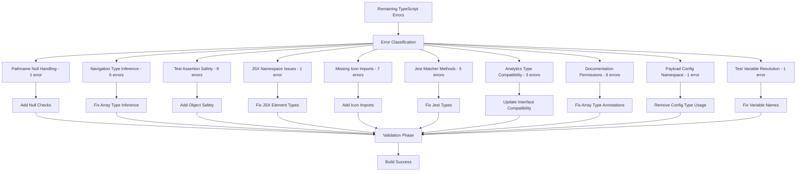

# TypeScript Error Fixes Design

## Overview

This design document outlines a systematic approach to resolve the remaining TypeScript compilation errors in the Modern Men Hair Salon documentation system. While significant progress has been made on the original error set, there are still critical issues that need resolution including pathname null handling, navigation type inference problems, test assertion safety, JSX namespace resolution, missing icon imports, Jest matcher availability, analytics type compatibility, documentation permissions array typing, Payload config namespace usage, and test variable definitions.

The solution involves implementing null-safe pathname handling, fixing type inference for navigation arrays, ensuring test object safety, resolving icon imports, updating analytics interfaces, and correcting Payload configuration patterns. The fixes are organized by error category and prioritized to minimize interdependencies and enable incremental validation.

The approach follows TypeScript best practices including strict null checking, proper type inference, explicit imports, interface compatibility, and maintaining code safety throughout the application.

## Architecture

### Error Classification and Resolution Strategy



### Fix Implementation Phases

#### Phase 1: Null Safety and Type Guards (Foundation)
- Pathname null handling in DocumentationLayoutClient
- Test object undefined safety checks
- Navigation item type inference fixes

#### Phase 2: Import and Dependency Resolution
- Missing icon imports from lucide-react
- Jest matcher method availability
- JSX Element namespace corrections

#### Phase 3: Interface and Type Compatibility
- Analytics service priority type updates
- Documentation permissions array typing
- Payload config namespace usage removal

#### Phase 4: Test Infrastructure Fixes
- Jest type definitions and globals
- Test variable name corrections
- Object safety in test assertions

#### Phase 5: Component and Navigation Safety
- Navigation array type inference
- Component return type corrections
- Route-based navigation safety

#### Phase 6: Build and Deployment Validation
- TypeScript strict mode compliance
- Build process error elimination
- CI/CD pipeline compatibility

## Components and Interfaces

### Enhanced Type Definitions

#### Pathname Null Safety Handling

```typescript
// DocumentationLayoutClient.tsx - Null-safe pathname handling
import { usePathname } from 'next/navigation';

interface DocumentationLayoutProps {
  children: React.ReactNode;
}

function DocumentationLayoutClient({ children }: DocumentationLayoutProps) {
  const pathname = usePathname();
  
  // Safe pathname handling with null checks
  const currentPath = pathname ?? '/documentation';
  const isActivePath = (path: string) => currentPath.startsWith(path);
  
  // Navigation filtering with null safety
  const filteredNavigation = useMemo(() => {
    if (!pathname) return [];
    
    return navigationItems.filter(item => 
      item.href && currentPath.startsWith(item.href)
    );
  }, [pathname]);
  
  return (
    <div className="documentation-layout">
      {/* Safe navigation rendering */}
    </div>
  );
}
```

#### Navigation Type Inference Resolution

```typescript
// documentation-permissions.ts - Proper navigation array typing
interface NavigationItem {
  title: string;
  href: string;
  sections?: NavigationSection[];
}

interface NavigationSection {
  title: string;
  href: string;
}

// Fixed navigation building with proper type inference
function buildNavigationForRole(role: string): NavigationItem[] {
  const navigation: NavigationItem[] = [];
  
  if (role === 'developer') {
    navigation.push({
      title: 'Developer Documentation',
      href: '/documentation/developer',
      sections: [
        { title: 'API Reference', href: '/documentation/developer/api' },
        { title: 'Components', href: '/documentation/developer/components' },
      ],
    });
  }
  
  return navigation;
}

// Type-safe navigation filtering
function filterNavigationItems(items: NavigationItem[], pathname: string): NavigationItem[] {
  return items.filter((item): item is NavigationItem => {
    return item.href && pathname.startsWith(item.href);
  });
}
```

#### Test Object Safety and Assertion Handling

```typescript
// AccessControl.test.tsx - Safe test object handling
import { render, screen } from '@testing-library/react';
import { AccessControl } from '../AccessControl';

describe('AccessControl Component', () => {
  test('renders content for authorized users', () => {
    const mockUser = {
      id: '1',
      role: 'admin',
      permissions: ['read', 'write'],
    };
    
    const result = render(
      <AccessControl user={mockUser} requiredPermission="read">
        <div>Protected content</div>
      </AccessControl>
    );
    
    // Safe assertion with null checking
    const protectedContent = screen.queryByText('Protected content');
    expect(protectedContent).toBeTruthy();
    
    // Alternative safe assertion pattern
    if (result.container) {
      expect(result.container).toHaveTextContent('Protected content');
    }
  });
  
  test('handles undefined render results gracefully', () => {
    const result = render(<AccessControl user={null} requiredPermission="read" />);
    
    // Safe object access with optional chaining
    expect(result?.container).toBeDefined();
    expect(result?.container?.textContent).toBe('');
  });
});
```

#### JSX Element Namespace Resolution

```typescript
// AccessControl.tsx - Proper JSX Element typing
import React from 'react';

interface AccessControlProps {
  user: User | null;
  requiredPermission: string;
  children?: React.ReactNode;
}

// Fixed return type using React.JSX.Element instead of global.JSX.Element
function AccessControl({ 
  user, 
  requiredPermission, 
  children 
}: AccessControlProps): React.JSX.Element | null {
  if (!user || !hasPermission(user, requiredPermission)) {
    return null;
  }
  
  return <>{children}</>;
}

// Alternative using ReactElement for broader compatibility
function AccessControlAlt({ 
  user, 
  requiredPermission, 
  children 
}: AccessControlProps): React.ReactElement | null {
  if (!user || !hasPermission(user, requiredPermission)) {
    return null;
  }
  
  return React.createElement(React.Fragment, null, children);
}
```

### Icon Import Resolution

#### Missing Lucide React Icon Imports

```typescript
// APIDocumentation.tsx - Proper icon imports
import {
  Download,           // Instead of DownloadIcon
  ChevronDown,        // Instead of ChevronDownIcon
  ChevronRight,       // Instead of ChevronRightIcon
  Play,               // Instead of PlayIcon
  Copy,               // Instead of CopyIcon
  Settings,           // For Documentationrch
  Info,               // For icons.tsx
  Mail,               // For icons.tsx
} from 'lucide-react';

// Usage in components
function APIDocumentation() {
  return (
    <div>
      <button>
        <Download className="w-4 h-4" />
        Download
      </button>
      
      <button>
        {isExpanded ? (
          <ChevronDown className="w-4 h-4" />
        ) : (
          <ChevronRight className="w-4 h-4" />
        )}
      </button>
      
      <button>
        <Play className="w-4 h-4" />
        Run Example
      </button>
      
      <button>
        <Copy className="w-4 h-4" />
        Copy Code
      </button>
    </div>
  );
}

// icons.tsx - Centralized icon exports
export {
  Settings,
  Info,
  Mail,
  Download,
  ChevronDown,
  ChevronRight,
  Play,
  Copy,
} from 'lucide-react';
```

#### Jest Matcher Method Resolution

```typescript
// jest-globals.d.ts - Enhanced Jest type definitions
import '@testing-library/jest-dom';

declare global {
  namespace jest {
    interface Matchers<R> {
      toThrow(): R;
      toThrow(error: string | RegExp | Error): R;
      toThrowError(): R;
      toThrowError(error: string | RegExp | Error): R;
    }
  }
}

// content-loader.test.ts - Fixed test assertions
describe('Content Loader', () => {
  test('throws error for invalid content', () => {
    const invalidLoader = () => {
      throw new Error('Invalid content format');
    };
    
    // Fixed: Ensure toThrow is available on function expectations
    expect(invalidLoader).toThrow('Invalid content format');
    expect(invalidLoader).toThrowError(/Invalid content/);
  });
  
  test('handles async errors properly', async () => {
    const asyncLoader = async () => {
      throw new Error('Async load failed');
    };
    
    // Proper async error testing
    await expect(asyncLoader()).rejects.toThrow('Async load failed');
  });
});

// Alternative approach using try-catch for complex scenarios
test('complex error handling', async () => {
  try {
    await loadContent('invalid-path');
    fail('Expected error to be thrown');
  } catch (error) {
    expect(error).toBeInstanceOf(Error);
    expect((error as Error).message).toContain('invalid-path');
  }
});
```

### Analytics Service Type Compatibility

#### ImprovementSuggestion Priority Type Extension

```typescript
// types/analytics.ts - Extended priority type
interface ImprovementSuggestion {
  contentId: string;
  type: 'clarity' | 'completeness' | 'accuracy' | 'performance';
  description: string;
  priority: 'low' | 'medium' | 'high' | 'critical'; // Added 'critical'
  estimatedImpact: number;
  basedOn: 'analytics' | 'feedback' | 'performance';
  suggestion?: string;
  actionRequired?: boolean;
}

// analytics-service.ts - Compatible implementation
class AnalyticsService {
  generateOptimizationRecommendations(): OptimizationRecommendations {
    const improvementSuggestions: ImprovementSuggestion[] = [
      {
        contentId: 'guide-123',
        type: 'clarity',
        description: 'Content needs clearer examples',
        priority: 'critical', // Now valid with extended type
        estimatedImpact: 85,
        basedOn: 'analytics',
      },
      {
        contentId: 'guide-456',
        type: 'performance',
        description: 'Page load time optimization needed',
        priority: 'high',
        estimatedImpact: 70,
        basedOn: 'performance',
      },
    ];
    
    return {
      improvementSuggestions,
      performanceOptimizations: [],
      contentGaps: [],
    };
  }
}
```

#### Payload CMS Config Namespace Resolution

```typescript
// payload.config.ts - Avoid Config namespace usage
import { buildConfig } from 'payload/config';
import { Documentation } from './payload/collections/Documentation';
import { DocumentationTemplates } from './payload/collections/DocumentationTemplates';
import { DocumentationWorkflows } from './payload/collections/DocumentationWorkflows';

// Remove Config type import and satisfies clause
// import type { Config } from 'payload'; // Remove this line

// Use function parameter typing instead of explicit Config type
export default buildConfig({
  serverURL: process.env.PAYLOAD_PUBLIC_SERVER_URL || 'http://localhost:3000',
  admin: {
    user: 'users',
    bundler: 'webpack',
  },
  collections: [
    Documentation,
    DocumentationTemplates,
    DocumentationWorkflows,
  ],
  typescript: {
    outputFile: path.resolve(__dirname, 'payload-types.ts'),
  },
  graphQL: {
    schemaOutputFile: path.resolve(__dirname, 'generated-schema.graphql'),
  },
  db: mongoodapter({
    url: process.env.DATABASE_URI || 'mongodb://localhost:27017/modernmen',
  }),
}); // Remove satisfies Config

// Alternative approach using Parameters utility type if needed
// const config: Parameters<typeof buildConfig>[0] = { ... };
// export default buildConfig(config);
```

### Test Variable Resolution

#### Documentation Permissions Test Fixes

```typescript
// documentation-permissions.test.ts - Fixed variable names and syntax
import { getNavigationForRole } from '../documentation-permissions';

describe('Documentation Permissions', () => {
  test('returns developer navigation sections', () => {
    const result = getNavigationForRole('developer');
    
    // Fixed: Correct variable name (was 'devS' + 'ections')
    const devSections = result.filter(item => 
      item.href.includes('/developer')
    );
    
    // Fixed: Proper comma separation in expect statements
    expect(devSections).toHaveLength(3);
    expect(devSections[0]?.title).toBe('API Documentation');
    expect(devSections[1]?.title).toBe('Component Library');
    expect(devSections[2]?.title).toBe('Architecture Guide');
  });
  
  test('filters navigation based on user permissions', () => {
    const adminNavigation = getNavigationForRole('admin');
    const userNavigation = getNavigationForRole('user');
    
    // Proper object property access with null checking
    expect(adminNavigation[0]?.title).toBe('System Administration');
    expect(userNavigation[0]?.title).toBe('User Guide');
    
    // Safe array access and property checking
    const adminSections = adminNavigation.find(item => 
      item.title === 'System Administration'
    );
    expect(adminSections?.sections).toBeDefined();
    expect(adminSections?.sections?.length).toBeGreaterThan(0);
  });
});

// Fixed navigation building function
function getNavigationForRole(role: string): NavigationItem[] {
  const navigation: NavigationItem[] = [];
  
  // Proper type-safe array building
  if (role === 'developer') {
    const developerSection: NavigationItem = {
      title: 'Developer Documentation',
      href: '/documentation/developer',
      sections: [
        { title: 'API Documentation', href: '/documentation/developer/api' },
        { title: 'Component Library', href: '/documentation/developer/components' },
      ],
    };
    navigation.push(developerSection);
  }
  
  return navigation;
}
```

#### Access Control Function Typing

```typescript
interface PayloadUser {
  id: string;
  email: string;
  role: string;
  permissions?: string[];
}

interface PayloadRequest {
  user?: PayloadUser;
  payload: any;
}

interface AccessControlContext {
  req: PayloadRequest;
  id?: string;
  data?: any;
}

// Properly typed access control functions
const accessControl = {
  create: ({ req: { user } }: AccessControlContext) => {
    return ['system_admin', 'salon_owner', 'developer'].includes(user?.role || '');
  },
  update: ({ req: { user } }: AccessControlContext) => {
    return ['system_admin', 'salon_owner', 'developer'].includes(user?.role || '');
  },
  delete: ({ req: { user } }: AccessControlContext) => {
    return ['system_admin', 'salon_owner'].includes(user?.role || '');
  },
};

// Hook typing
interface HookContext {
  data: any;
  req: PayloadRequest;
  operation: 'create' | 'update' | 'delete';
}

const beforeChangeHook = async ({ data, req, operation }: HookContext) => {
  // Properly typed hook implementation
  return data;
};
```

## Data Models

### Performance Monitoring Type Updates

#### Modern Performance API Usage

```typescript
// Updated performance monitoring to use current APIs
interface ModernPerformanceMetrics {
  navigationTiming: {
    loadEventEnd: number;
    domContentLoadedEventEnd: number;
    responseEnd: number;
    requestStart: number;
  };
  resourceTiming: PerformanceResourceTiming[];
  userTiming: PerformanceMeasure[];
}

// Fixed performance measurement
function measurePageLoad(): number {
  const navigation = performance.getEntriesByType('navigation')[0] as PerformanceNavigationTiming;
  
  // Use current properties instead of deprecated navigationStart
  const loadTime = navigation.loadEventEnd - navigation.fetchStart;
  return Math.round(loadTime);
}

// Monitoring service with proper typing
class MonitoringService {
  setUser(user: { id?: string; email?: string | null; role?: string }) {
    // Handle nullable email properly
    const userEmail = user.email ?? undefined;
    
    this.analytics.identify(user.id, {
      email: userEmail,
      role: user.role,
    });
  }
}
```

### Template and Code Generation Fixes

#### CodeGenerator Variable Resolution

```typescript
interface CodeGeneratorContext {
  endpoint: APIEndpoint;
  authentication: AuthConfig;
  queryParams: QueryParameter[];
  requestBody?: any;
}

class CodeGenerator {
  generateQueryStringCode(params: QueryParameter[]): string {
    if (!params || params.length === 0) {
      return '// No query parameters';
    }
    
    const paramStrings = params.map(param => 
      `${param.name}=${encodeURIComponent(param.example || param.name)}`
    );
    
    return `const queryString = '${paramStrings.join('&')}';`;
  }
  
  generateCode(context: CodeGeneratorContext): string {
    const queryStringCode = this.generateQueryStringCode(context.queryParams);
    
    return `
// API Request Example
${queryStringCode}

const response = await fetch(\`\${baseUrl}\${endpoint.path}?\${queryString}\`, {
  method: '${context.endpoint.method}',
  headers: {
    'Content-Type': 'application/json',
    ...authHeaders
  }
});
    `;
  }
}
```

## Error Handling

### Comprehensive Error Type Safety

#### Logger Type Compatibility

```typescript
interface LogContext {
  [key: string]: any;
}

interface Logger {
  info(message: string, context?: LogContext): void;
  warn(message: string, context?: LogContext): void;
  error(message: string, context?: LogContext): void;
  debug(message: string, context?: LogContext): void;
}

// Fixed error logging with proper type casting
function handlePayloadError(error: unknown): void {
  const errorContext: LogContext = {
    timestamp: new Date().toISOString(),
    stack: error instanceof Error ? error.stack : 'No stack trace',
    message: error instanceof Error ? error.message : String(error),
  };
  
  logger.error('Payload initialization failed:', errorContext);
}
```

#### Type-Safe Error Boundaries

```typescript
interface ErrorBoundaryState {
  hasError: boolean;
  error?: Error;
  errorInfo?: ErrorInfo;
}

class TypeSafeErrorBoundary extends Component<PropsWithChildren, ErrorBoundaryState> {
  constructor(props: PropsWithChildren) {
    super(props);
    this.state = { hasError: false };
  }
  
  static getDerivedStateFromError(error: Error): ErrorBoundaryState {
    return {
      hasError: true,
      error,
    };
  }
  
  componentDidCatch(error: Error, errorInfo: ErrorInfo) {
    // Type-safe error logging
    const errorContext: LogContext = {
      error: error.message,
      stack: error.stack,
      componentStack: errorInfo.componentStack,
    };
    
    logger.error('React error boundary caught error:', errorContext);
  }
}
```

## Testing Strategy

### Type Safety Validation Testing

#### Compilation Testing

```typescript
describe('TypeScript Compilation', () => {
  test('All files compile without errors', async () => {
    const result = await runTypeScriptCompiler({
      configFile: 'tsconfig.json',
      noEmit: true,
      strict: true,
    });
    
    expect(result.errors).toHaveLength(0);
    expect(result.exitCode).toBe(0);
  });
  
  test('Strict mode compliance', async () => {
    const result = await runTypeScriptCompiler({
      strict: true,
      noImplicitAny: true,
      noImplicitReturns: true,
      noImplicitThis: true,
    });
    
    expect(result.errors).toHaveLength(0);
  });
});
```

#### Interface Compliance Testing

```typescript
describe('Interface Compliance', () => {
  test('ValidationError objects include all required properties', () => {
    const error: ValidationError = {
      message: 'Test error',
      severity: 'error',
      type: 'content',
      line: 1,
      column: 1,
    };
    
    expect(error).toHaveProperty('type');
    expect(error.type).toBe('content');
  });
  
  test('User objects include permissions property', () => {
    const user: User = {
      id: '1',
      email: 'test@example.com',
      permissions: ['read', 'write'],
    };
    
    expect(user).toHaveProperty('permissions');
    expect(Array.isArray(user.permissions)).toBe(true);
  });
});
```

#### API Route Testing

```typescript
describe('API Route Type Safety', () => {
  test('Business documentation route handles async params', async () => {
    const mockParams = Promise.resolve({ id: 'test-id' });
    const mockRequest = new NextRequest('http://localhost/api/business-documentation/test-id');
    
    // Should not throw type errors
    const response = await GET(mockRequest, { params: mockParams });
    expect(response).toBeInstanceOf(NextResponse);
  });
});
```

### Integration Testing

#### Component Integration Testing

```typescript
describe('Component Type Integration', () => {
  test('GuideRenderer accepts correct props', () => {
    const guide: GuideContent = {
      metadata: {
        id: 'test-guide',
        title: 'Test Guide',
        description: 'Test description',
        author: 'Test Author',
        lastUpdated: new Date(),
        version: { major: 1, minor: 0, patch: 0 },
        targetAudience: ['developer'],
        difficulty: 'beginner',
        estimatedTime: 30,
        tags: ['test'],
        locale: 'en',
        deprecated: false,
      },
      content: {
        introduction: 'Test introduction',
        prerequisites: [],
        steps: [],
        troubleshooting: [],
        relatedContent: [],
        codeSnippets: [],
      },
      validation: {
        reviewed: true,
        reviewedBy: 'Test Reviewer',
        reviewDate: new Date(),
        accuracy: 100,
        accessibilityCompliant: true,
        lastValidated: new Date(),
      },
      analytics: {
        viewCount: 0,
        completionRate: 0,
        averageRating: 0,
        feedbackCount: 0,
        rchRanking: 0,
      },
      versioning: {
        changeHistory: [],
        previousVersions: [],
      },
    };
    
    render(<GuideRenderer guide={guide} />);
    // Should render without type errors
  });
});
```

### Build Validation

#### CI/CD Type Checking

```typescript
// GitHub Actions workflow validation
const buildValidation = {
  typeCheck: {
    command: 'npx tsc --noEmit',
    expectedExitCode: 0,
    timeout: 300000, // 5 minutes
  },
  
  strictTypeCheck: {
    command: 'npx tsc --noEmit --strict',
    expectedExitCode: 0,
    timeout: 300000,
  },
  
  buildCheck: {
    command: 'npm run build',
    expectedExitCode: 0,
    timeout: 600000, // 10 minutes
  },
};
```

This design provides a comprehensive approach to fixing all TypeScript errors while maintaining code quality, type safety, and system functionality. The phased approach allows for incremental validation and reduces the risk of introducing new errors during the fix process.