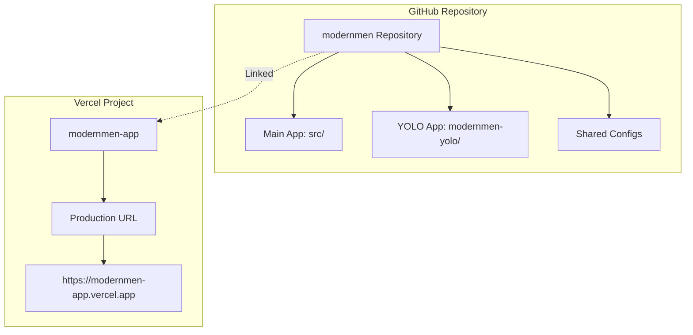
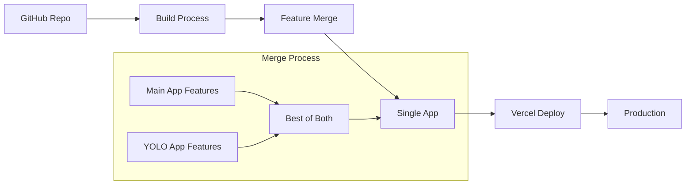
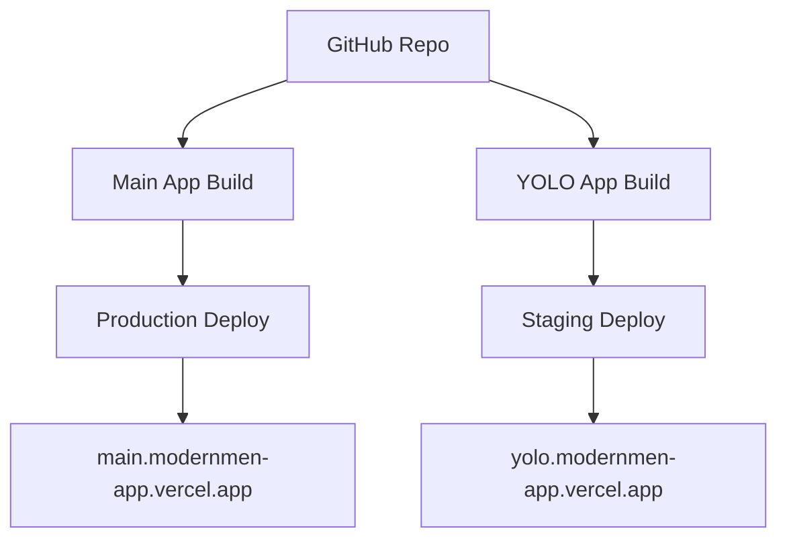
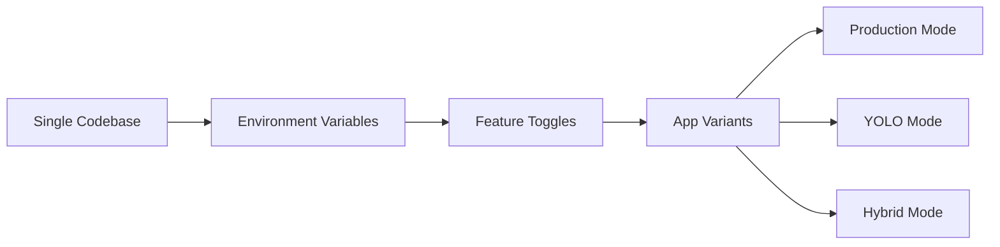

# 🚀 Modern Men Deployment Flow Diagram

## 📊 Current State



## 🔄 Deployment Strategies

### Strategy 1: Unified App (Recommended)


### Strategy 2: Dual Deployment


### Strategy 3: Feature Flags


## 🎯 Recommended Approach

### Phase 1: Analysis & Planning
```
┌─────────────────┐    ┌─────────────────┐    ┌─────────────────┐
│   Main App      │    │   YOLO App      │    │   Comparison    │
│   Analysis      │    │   Analysis      │    │   Matrix        │
└─────────────────┘    └─────────────────┘    └─────────────────┘
         │                       │                       │
         └───────────────────────┼───────────────────────┘
                                 │
                    ┌─────────────────┐
                    │   Feature       │
                    │   Selection     │
                    └─────────────────┘
```

### Phase 2: Unified Development
```
┌─────────────────┐    ┌─────────────────┐    ┌─────────────────┐
│   Core          │    │   Enhanced      │    │   Integration   │
│   Features      │    │   Features      │    │   Layer         │
└─────────────────┘    └─────────────────┘    └─────────────────┘
         │                       │                       │
         └───────────────────────┼───────────────────────┘
                                 │
                    ┌─────────────────┐
                    │   Unified       │
                    │   Application   │
                    └─────────────────┘
```

### Phase 3: Deployment
```
┌─────────────────┐    ┌─────────────────┐    ┌─────────────────┐
│   Build         │    │   Test          │    │   Deploy        │
│   Process       │    │   Suite         │    │   Pipeline      │
└─────────────────┘    └─────────────────┘    └─────────────────┘
         │                       │                       │
         └───────────────────────┼───────────────────────┘
                                 │
                    ┌─────────────────┐
                    │   Production    │
                    │   Release       │
                    └─────────────────┘
```

## 📋 Implementation Checklist

### ✅ Completed
- [x] Repository merge
- [x] Vercel project linking
- [x] Structure mapping
- [x] Feature comparison

### 🔄 In Progress
- [ ] Package dependency resolution
- [ ] Environment variable unification
- [ ] Build configuration setup

### 📋 Next Steps
- [ ] Choose deployment strategy
- [ ] Set up unified build pipeline
- [ ] Configure Vercel deployment
- [ ] Test both app versions
- [ ] Deploy to production

## 🎯 Key Decision Points

1. **Single vs Dual App**: Which approach do you prefer?
2. **Feature Selection**: Which features from each app to keep?
3. **Deployment Strategy**: How to handle the deployment flow?
4. **Environment Management**: How to manage different environments?

---

*This diagram shows the current state and potential deployment strategies for the merged Modern Men repository.*
