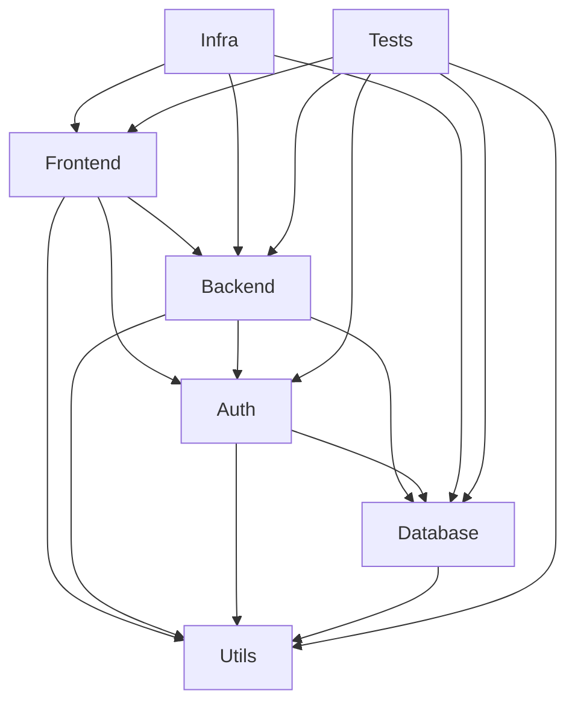

# 🏗️ **Modern Men Hair Salon - Modular Architecture**

## **🎯 Mission Statement**
A modern, scalable hair salon management system built with clean architecture principles, enabling seamless customer experiences and efficient business operations.

---

## **📦 Modular Architecture Overview**

### **🏗️ Package Structure**
```
/app-root
├── packages/
│   ├── frontend/           # Next.js UI Layer
│   ├── backend/            # API & Business Logic
│   ├── auth/               # Authentication & Authorization
│   ├── db/                 # Database Schema & Migrations
│   ├── utils/              # Shared Utilities & Helpers
│   ├── infra/              # Infrastructure & Deployment
│   └── tests/              # Test Suites & Automation
│
├── scripts/                 # Global Automation Scripts
├── package.json             # Root Orchestration
├── turbo.json              # Build Pipeline Configuration
└── README.md               # This Documentation
```

### **📋 Package Responsibilities**

#### **🎨 Frontend Package (`packages/frontend/`)**
**Purpose**: User interface and client-side application
- **Tech**: Next.js 14, React 18, Tailwind CSS, Framer Motion
- **Responsibilities**:
  - Customer-facing website
  - Admin dashboard
  - Booking system UI
  - Responsive design
  - Progressive Web App features

#### **⚙️ Backend Package (`packages/backend/`)**
**Purpose**: Server-side logic and API endpoints
- **Tech**: Node.js, Express, Payload CMS
- **Responsibilities**:
  - RESTful API endpoints
  - Business logic implementation
  - Data validation and sanitization
  - Email/SMS notifications
  - Payment processing integration

#### **🔐 Auth Package (`packages/auth/`)**
**Purpose**: Authentication and authorization services
- **Tech**: NextAuth.js, JWT, bcrypt
- **Responsibilities**:
  - User registration and login
  - Session management
  - Role-based access control
  - OAuth integrations
  - Password reset flows

#### **💾 Database Package (`packages/db/`)**
**Purpose**: Database schema and data management
- **Tech**: Prisma, PostgreSQL, Supabase
- **Responsibilities**:
  - Database schema definition
  - Migration scripts
  - Seed data management
  - Database connection handling
  - Query optimization

#### **🛠️ Utils Package (`packages/utils/`)**
**Purpose**: Shared utilities and business logic
- **Tech**: TypeScript, Zod, date-fns
- **Responsibilities**:
  - Data validation schemas
  - Formatting utilities
  - Error handling framework
  - Logging system
  - Business constants and enums

#### **🏗️ Infra Package (`packages/infra/`)**
**Purpose**: Infrastructure and deployment configuration
- **Tech**: Vercel, Docker, Terraform
- **Responsibilities**:
  - Deployment configurations
  - Infrastructure as Code
  - CI/CD pipelines
  - Monitoring setup
  - Security configurations

#### **🧪 Tests Package (`packages/tests/`)**
**Purpose**: Comprehensive testing suite
- **Tech**: Jest, Playwright, Cypress
- **Responsibilities**:
  - Unit tests for all packages
  - Integration tests
  - End-to-end tests
  - Performance testing
  - Accessibility testing

---

## **🚀 Getting Started**

### **Prerequisites**
- Node.js 18+ and npm 9+
- PostgreSQL database
- Git

### **Installation & Setup**

1. **Clone the repository**
```bash
git clone <repository-url>
   cd modernmen-hair-salon
   ```

2. **Install root dependencies**
   ```bash
   npm install
   ```

3. **Install all package dependencies**
   ```bash
   npm run install:all
   ```

4. **Set up environment variables**
   ```bash
   cp packages/frontend/.env.example packages/frontend/.env.local
   cp packages/backend/.env.example packages/backend/.env.local
   # Edit environment files with your actual values
   ```

5. **Set up the database**
```bash
   npm run db:setup
   ```

6. **Build all packages**
   ```bash
   npm run build
   ```

7. **Start development servers**
   ```bash
   npm run dev
   ```

---

## **📜 Available Scripts**

### **Root Level Scripts**
```bash
# Development
npm run dev              # Start all development servers
npm run dev:frontend     # Start only frontend dev server
npm run dev:backend      # Start only backend dev server

# Building
npm run build           # Build all packages
npm run build:frontend  # Build only frontend
npm run build:backend   # Build only backend

# Testing
npm run test            # Run all tests
npm run test:unit       # Run unit tests only
npm run test:e2e        # Run end-to-end tests

# Database
npm run db:migrate      # Run database migrations
npm run db:seed         # Seed database with sample data
npm run db:studio       # Open Prisma Studio

# Deployment
npm run deploy:vercel   # Deploy to Vercel
npm run deploy:staging  # Deploy to staging
npm run deploy:prod     # Deploy to production
```

### **Package-Specific Scripts**
Each package has its own `package.json` with specific scripts:

```bash
# Frontend package
cd packages/frontend
npm run dev     # Next.js development server
npm run build   # Production build
npm run lint    # ESLint checking

# Backend package
cd packages/backend
npm run dev     # Express development server
npm run build   # TypeScript compilation
npm run start   # Production server

# Database package
cd packages/db
npm run db:generate    # Generate Prisma client
npm run db:migrate     # Run migrations
npm run db:studio      # Open Prisma Studio
```

---

## **🔧 Development Workflow**

### **1. Feature Development**
```bash
# 1. Create a feature branch
git checkout -b feature/new-booking-system

# 2. Make changes in appropriate packages
# Edit packages/frontend/src/components/booking/
# Edit packages/backend/src/routes/appointments.ts

# 3. Run tests
npm run test

# 4. Build and verify
npm run build

# 5. Commit changes
git add .
git commit -m "feat: implement new booking system"

# 6. Create pull request
git push origin feature/new-booking-system
```

### **2. Adding a New Package**
```bash
# 1. Create package directory
mkdir packages/new-package

# 2. Initialize package.json
cd packages/new-package
npm init -y

# 3. Add to root package.json workspaces
# Edit root package.json to include "packages/new-package"

# 4. Update turbo.json if needed
# Add build/test scripts for the new package
```

### **3. Cross-Package Dependencies**
```bash
# Use workspace references in package.json
{
  "dependencies": {
    "@modernmen/utils": "workspace:*",
    "@modernmen/db": "workspace:*"
  }
}
```

---

## **📊 Architecture Benefits**

### **✅ Modularity Benefits**
- **Independent Deployment**: Deploy packages separately
- **Faster Builds**: Only rebuild changed packages
- **Clear Ownership**: Each package has single responsibility
- **Easy Testing**: Test packages in isolation
- **Scalability**: Add new packages without affecting others

### **✅ Development Benefits**
- **Parallel Development**: Teams work on different packages
- **Faster Onboarding**: New developers focus on specific areas
- **Reduced Conflicts**: Fewer merge conflicts between features
- **Better Debugging**: Issues isolated to specific packages

### **✅ Maintenance Benefits**
- **Easier Updates**: Update dependencies per package
- **Version Management**: Independent versioning
- **Code Reuse**: Shared utilities across packages
- **Performance**: Only load what's needed

---

## **🔗 Package Dependencies**



---

## **🚀 Deployment Strategy**

### **Vercel Deployment**
```bash
# Deploy frontend only
npm run deploy:vercel

# Or deploy from frontend package
cd packages/frontend
npm run deploy:vercel
```

### **Docker Deployment**
```bash
# Build Docker image
npm run docker:build

# Run in development
npm run docker:dev

# Deploy to production
npm run docker:deploy
```

### **Multi-Environment Support**
```bash
# Development
npm run dev

# Staging
npm run build:staging
npm run deploy:staging

# Production
npm run build:prod
npm run deploy:prod
```

---

## **📈 Performance Optimization**

### **Build Optimization**
- **Turbo**: Fast incremental builds
- **Code Splitting**: Automatic route-based splitting
- **Tree Shaking**: Remove unused code
- **Bundle Analysis**: Monitor bundle sizes

### **Runtime Optimization**
- **Lazy Loading**: Components loaded on demand
- **Caching**: Intelligent caching strategies
- **CDN**: Static assets served via CDN
- **Compression**: Gzip compression enabled

### **Database Optimization**
- **Connection Pooling**: Efficient database connections
- **Query Optimization**: Optimized database queries
- **Indexing**: Proper database indexes
- **Caching**: Database query caching

---

## **🧪 Testing Strategy**

### **Test Types**
```bash
# Unit Tests
npm run test:unit         # Individual function/component tests

# Integration Tests
npm run test:integration  # Package interaction tests

# End-to-End Tests
npm run test:e2e          # Full user journey tests

# Performance Tests
npm run test:performance  # Load and performance tests
```

### **Test Coverage**
- **Frontend**: Component testing, user interactions
- **Backend**: API endpoint testing, business logic
- **Auth**: Authentication flow testing
- **Database**: Data integrity and migration testing

---

## **🔒 Security Considerations**

### **Authentication & Authorization**
- JWT tokens with proper expiration
- Role-based access control (RBAC)
- Secure password hashing
- OAuth integration for social login

### **Data Protection**
- Input validation and sanitization
- SQL injection prevention
- XSS protection
- CSRF protection

### **Infrastructure Security**
- HTTPS everywhere
- Environment variable protection
- Database encryption
- Regular security audits

---

## **📚 API Documentation**

### **Frontend API**
- **Base URL**: `/api`
- **Authentication**: Bearer tokens
- **Rate Limiting**: 100 requests per 15 minutes

### **Backend API**
- **Base URL**: `/api/v1`
- **Authentication**: JWT tokens
- **Documentation**: Swagger/OpenAPI available

### **Key Endpoints**
```typescript
// Authentication
POST /api/auth/login
POST /api/auth/register
POST /api/auth/logout

// Appointments
GET /api/appointments
POST /api/appointments
PUT /api/appointments/:id
DELETE /api/appointments/:id

// Services
GET /api/services
POST /api/services
PUT /api/services/:id

// Customers
GET /api/customers
POST /api/customers
PUT /api/customers/:id
```

---

## **🤝 Contributing Guidelines**

### **Code Standards**
- **TypeScript**: Strict mode enabled
- **ESLint**: Airbnb configuration
- **Prettier**: Consistent code formatting
- **Husky**: Pre-commit hooks for quality checks

### **Commit Convention**
```bash
feat: add new booking feature
fix: resolve authentication redirect issue
docs: update API documentation
test: add unit tests for user service
refactor: optimize database queries
```

### **Pull Request Process**
1. Create feature branch from `main`
2. Make changes following code standards
3. Add/update tests
4. Update documentation
5. Create pull request
6. Code review and approval
7. Merge to main

---

## **📞 Support & Resources**

### **Documentation**
- [API Documentation](./docs/api.md)
- [Architecture Guide](./docs/architecture.md)
- [Deployment Guide](./docs/deployment.md)
- [Contributing Guide](./docs/contributing.md)

### **Development Resources**
- [Next.js Documentation](https://nextjs.org/docs)
- [Prisma Documentation](https://www.prisma.io/docs)
- [Tailwind CSS Documentation](https://tailwindcss.com/docs)
- [Turbo Documentation](https://turbo.build/repo/docs)

### **Community & Support**
- [GitHub Issues](https://github.com/your-repo/issues)
- [Discord Community](https://discord.gg/your-server)
- [Email Support](mailto:support@modernmen.ca)

---

## **🎯 Roadmap**

### **Phase 1: Core Features (Current)**
- ✅ Modular architecture implementation
- ✅ Authentication system
- ✅ Booking management
- ✅ Customer portal
- ✅ Admin dashboard

### **Phase 2: Advanced Features (Next)**
- 🔄 Mobile application
- 🔄 Loyalty program
- 🔄 Advanced analytics
- 🔄 Multi-location support
- 🔄 Integration APIs

### **Phase 3: Enterprise Features (Future)**
- 📋 AI-powered recommendations
- 📋 Advanced reporting
- 📋 Franchise management
- 📋 International expansion
- 📋 Advanced integrations

---

## **📄 License**
This project is licensed under the MIT License - see the [LICENSE](LICENSE) file for details.

---

## **🙏 Acknowledgments**
Built with ❤️ for the modern men's grooming industry. Special thanks to the Modern Men team and our amazing customers.

**Modern Men Hair Salon** © 2025. All rights reserved.