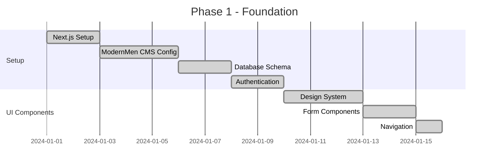
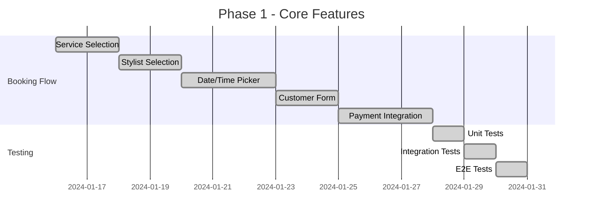
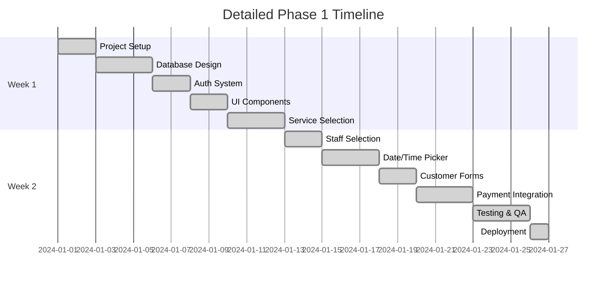
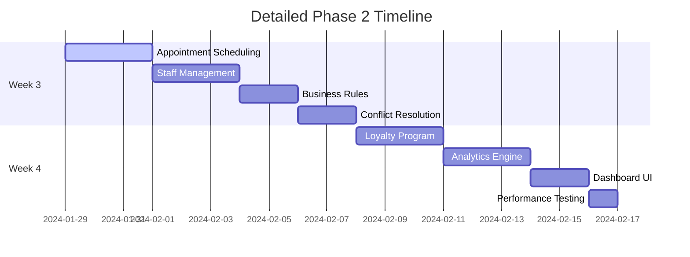
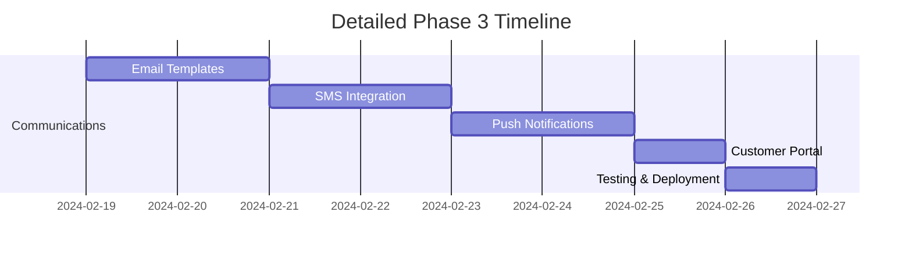
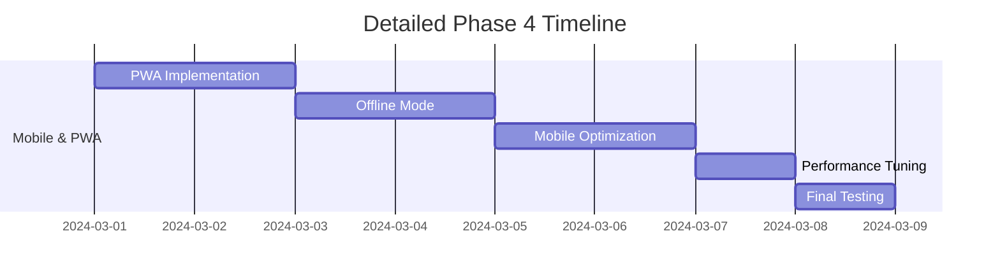

# 📋 IMPLEMENTATION ROADMAP GRAPH

```
┌─────────────────────────────────────────────────────────────────────────────────┐
│                      IMPLEMENTATION ROADMAP GRAPH                               │
└─────────────────────────────────────────────────────────────────────────────────┘

┌─────────────────────────────────────────────────────────────────────────────────┐
│                          PHASE 1: CORE BOOKING                                 │
├─────────────────────────────────────────────────────────────────────────────────┤
│  ┌─────────────┐  ┌─────────────┐  ┌─────────────┐  ┌─────────────┐  ┌─────────────┐ │
│  │ Service     │  │ Stylist     │  │ Date/Time   │  │ Customer    │  │ Payment     │ │
│  │ Selection   │  │ Selection   │  │ Selection   │  │ Info Form   │  │ Processing  │ │
│  │  (Wizard)   │  │ (Calendar)  │  │ (Picker)    │  │ (Form)      │  │ (Stripe)    │ │
│  └─────────────┘  └─────────────┘  └─────────────┘  └─────────────┘  └─────────────┘ │
│                                                                                      │
│  ┌───────────────────────────────────────────────────────────────────────────────┐   │
│  │                        PHASE 2: BUSINESS LOGIC                             │   │
│  ├───────────────────────────────────────────────────────────────────────────────┤   │
│  │  ┌─────────────┐  ┌─────────────┐  ┌─────────────┐  ┌─────────────┐         │   │
│  │  │ Appointment │  │ Staff       │  │ Loyalty     │  │ Analytics   │         │   │
│  │  │ Scheduling  │  │ Scheduling  │  │ Program     │  │ Dashboard   │         │   │
│  │  │ (Conflict)  │  │ (Shifts)    │  │ (Points)     │  │ (Charts)    │         │   │
│  │  └─────────────┘  └─────────────┘  └─────────────┘  └─────────────┘         │   │
│  └───────────────────────────────────────────────────────────────────────────────┘   │
│                                                                                      │
│  ┌───────────────────────────────────────────────────────────────────────────────┐   │
│  │                        PHASE 3: COMMUNICATIONS                              │   │
│  ├───────────────────────────────────────────────────────────────────────────────┤   │
│  │  ┌─────────────┐  ┌─────────────┐  ┌─────────────┐  ┌─────────────┐         │   │
│  │  │ Email       │  │ SMS         │  │ Push        │  │ Customer     │         │   │
│  │  │ Templates   │  │ Notifications│  │ Notifications│  │ Portal       │         │   │
│  │  │ (SendGrid)  │  │ (Twilio)     │  │ (Web)        │  │ (Dashboard)  │         │   │
│  │  └─────────────┘  └─────────────┘  └─────────────┘  └─────────────┘         │   │
│  └───────────────────────────────────────────────────────────────────────────────┘   │
│                                                                                      │
│  ┌───────────────────────────────────────────────────────────────────────────────┐   │
│  │                        PHASE 4: MOBILE & PWA                               │   │
│  ├───────────────────────────────────────────────────────────────────────────────┤   │
│  │  ┌─────────────┐  ┌─────────────┐  ┌─────────────┐  ┌─────────────┐         │   │
│  │  │ Responsive  │  │ PWA         │  │ Offline     │  │ Mobile      │         │   │
│  │  │ Design      │  │ Features    │  │ Mode        │  │ App         │         │   │
│  │  │ (Tailwind)  │  │ (Service)   │  │ (Cache)      │  │ (React)     │         │   │
│  │  └─────────────┘  └─────────────┘  └─────────────┘  └─────────────┘         │   │
│  └───────────────────────────────────────────────────────────────────────────────┘   │
└──────────────────────────────────────────────────────────────────────────────────────┘

TIMELINE: 📅 Phase 1 (2 weeks) → Phase 2 (2 weeks) → Phase 3 (1 week) → Phase 4 (1 week)
```

## 📋 **Implementation Roadmap**

### 🎯 **Phase 1: Core Booking System** (Weeks 1-2)

#### **Week 1: Foundation**


#### **Week 2: Core Features**


### 🔄 **Phase 2: Business Logic** (Weeks 3-4)

#### **Appointment Management**
```typescript
interface AppointmentSystem {
  // Core scheduling
  scheduleAppointment(appointment: AppointmentData): Promise<Appointment>;
  checkAvailability(slot: TimeSlot): Promise<boolean>;
  handleConflicts(appointments: Appointment[]): Appointment[];

  // Business rules
  validateBusinessHours(time: DateTime): boolean;
  calculateServiceDuration(services: Service[]): number;
  applyPricingRules(services: Service[], customer: Customer): Price;

  // Staff management
  assignStaff(appointment: Appointment): Promise<Staff>;
  trackStaffSchedule(staffId: string): StaffSchedule;
}
```

#### **Staff Scheduling System**
```typescript
interface StaffScheduler {
  // Schedule management
  createSchedule(staffId: string, schedule: Schedule): Promise<Schedule>;
  updateAvailability(staffId: string, availability: Availability): Promise<void>;
  getAvailableStaff(serviceId: string, dateTime: DateTime): Promise<Staff[]>;

  // Time off management
  requestTimeOff(staffId: string, request: TimeOffRequest): Promise<void>;
  approveTimeOff(requestId: string): Promise<void>;
  calculateStaffHours(staffId: string, period: DateRange): number;
}
```

#### **Loyalty Program**
```typescript
interface LoyaltySystem {
  // Points system
  earnPoints(customerId: string, transaction: Transaction): Promise<void>;
  redeemPoints(customerId: string, points: number): Promise<void>;
  getPointsBalance(customerId: string): Promise<number>;

  // Rewards management
  createReward(reward: Reward): Promise<Reward>;
  claimReward(customerId: string, rewardId: string): Promise<void>;
  trackRewardUsage(rewardId: string): RewardAnalytics;
}
```

#### **Analytics Dashboard**
```typescript
interface AnalyticsEngine {
  // Business metrics
  getRevenueMetrics(period: DateRange): Promise<RevenueMetrics>;
  getAppointmentMetrics(period: DateRange): Promise<AppointmentMetrics>;
  getCustomerMetrics(period: DateRange): Promise<CustomerMetrics>;

  // Operational metrics
  getStaffPerformance(staffId: string): Promise<StaffPerformance>;
  getServicePopularity(): Promise<ServicePopularity[]>;
  getCancellationRate(period: DateRange): Promise<number>;
}
```

### 📧 **Phase 3: Communications** (Week 5)

#### **Email System**
```typescript
interface EmailService {
  // Template management
  createTemplate(template: EmailTemplate): Promise<EmailTemplate>;
  sendTemplatedEmail(templateId: string, recipient: EmailRecipient): Promise<void>;

  // Automated emails
  sendBookingConfirmation(appointment: Appointment): Promise<void>;
  sendAppointmentReminder(appointment: Appointment): Promise<void>;
  sendCancellationNotice(appointment: Appointment): Promise<void>;
  sendPaymentReceipt(payment: Payment): Promise<void>;

  // Marketing emails
  sendPromotionalEmail(campaign: EmailCampaign): Promise<void>;
  sendNewsletter(subscribers: Subscriber[]): Promise<void>;
}
```

#### **SMS Notifications**
```typescript
interface SMSService {
  // Core messaging
  sendSMS(phoneNumber: string, message: string): Promise<void>;
  sendBulkSMS(recipients: string[], message: string): Promise<void>;

  // Appointment notifications
  sendAppointmentReminder(appointment: Appointment): Promise<void>;
  sendAppointmentConfirmation(appointment: Appointment): Promise<void>;
  sendLastMinuteReminder(appointment: Appointment): Promise<void>;

  // Marketing SMS
  sendPromotionalSMS(campaign: SMSCampaign): Promise<void>;
}
```

#### **Push Notifications**
```typescript
interface PushService {
  // Device management
  registerDevice(deviceToken: string, userId: string): Promise<void>;
  unregisterDevice(deviceToken: string): Promise<void>;

  // Notification types
  sendAppointmentReminder(appointment: Appointment): Promise<void>;
  sendPromotionalNotification(notification: PushNotification): Promise<void>;
  sendSystemNotification(notification: SystemNotification): Promise<void>;

  // Analytics
  trackNotificationOpen(notificationId: string): Promise<void>;
  getNotificationStats(notificationId: string): Promise<NotificationStats>;
}
```

### 📱 **Phase 4: Mobile & PWA** (Week 6)

#### **Progressive Web App**
```typescript
interface PWAService {
  // Service worker
  registerServiceWorker(): Promise<void>;
  updateServiceWorker(): Promise<void>;

  // Offline functionality
  cacheResources(resources: string[]): Promise<void>;
  handleOfflineRequests(): Promise<void>;
  syncPendingRequests(): Promise<void>;

  // Install prompt
  showInstallPrompt(): Promise<void>;
  trackInstallEvent(): Promise<void>;
}
```

#### **Mobile Optimization**
```typescript
interface MobileOptimization {
  // Touch interactions
  handleTouchGestures(element: HTMLElement): void;
  optimizeTouchTargets(): void;

  // Performance
  lazyLoadImages(): void;
  optimizeBundleSize(): void;
  implementVirtualScrolling(): void;

  // UX improvements
  addPullToRefresh(): void;
  implementSwipeActions(): void;
  addHapticFeedback(): void;
}
```

#### **Offline Mode**
```typescript
interface OfflineService {
  // Data synchronization
  syncLocalData(): Promise<void>;
  handleOnlineReconnection(): Promise<void>;
  resolveDataConflicts(): Promise<void>;

  // Cache management
  cacheCriticalData(): Promise<void>;
  updateCacheStrategy(): void;

  // User feedback
  showOfflineIndicator(): void;
  queueOfflineActions(): void;
}
```

---

## 📊 **Detailed Timeline**

### **Week 1-2: Core Booking System**


### **Week 3-4: Business Logic**


### **Week 5: Communications**


### **Week 6: Mobile & PWA**


---

## 🎯 **Success Metrics**

### **Phase 1 Success Criteria**
- ✅ **Functionality**: Complete booking flow working end-to-end
- ✅ **Performance**: <2s page load time, <250ms API response
- ✅ **Quality**: 80%+ test coverage, 0 critical bugs
- ✅ **User Experience**: Intuitive booking process, mobile responsive
- ✅ **Security**: Secure payment processing, data encryption

### **Phase 2 Success Criteria**
- ✅ **Business Logic**: Complex scheduling rules implemented
- ✅ **Staff Management**: Automated staff assignment and scheduling
- ✅ **Analytics**: Real-time dashboard with key metrics
- ✅ **Loyalty**: Points earning and redemption system
- ✅ **Scalability**: System handles 1000+ concurrent users

### **Phase 3 Success Criteria**
- ✅ **Communications**: Multi-channel notification system
- ✅ **Templates**: Professional email and SMS templates
- ✅ **Automation**: Automated reminders and confirmations
- ✅ **Customer Portal**: Self-service customer dashboard
- ✅ **Marketing**: Promotional campaign capabilities

### **Phase 4 Success Criteria**
- ✅ **Mobile Experience**: Native app-like PWA experience
- ✅ **Offline Mode**: Core functionality works offline
- ✅ **Performance**: 90+ Lighthouse score across devices
- ✅ **PWA Features**: Install prompt, service worker, push notifications
- ✅ **Cross-Platform**: Consistent experience on all devices

---

## 🔧 **Technical Dependencies**

### **Phase 1 Dependencies**
- ✅ Next.js 15 setup and configuration
- ✅ ModernMen CMS installation and configuration
- ✅ Supabase database setup and connection
- ✅ Stripe payment integration setup
- ✅ Basic UI component library

### **Phase 2 Dependencies**
- 🔄 Advanced ModernMen CMS configuration
- 🔄 Supabase real-time features
- 🔄 Chart.js or similar for analytics
- 🔄 Background job processing (optional)
- 🔄 Advanced caching strategies

### **Phase 3 Dependencies**
- 🔄 SendGrid email service setup
- 🔄 Twilio SMS service setup
- 🔄 Firebase Cloud Messaging setup
- 🔄 Email template engine
- 🔄 Notification queue system

### **Phase 4 Dependencies**
- 🔄 Service Worker implementation
- 🔄 PWA manifest configuration
- 🔄 Offline storage strategies
- 🔄 Mobile-specific optimizations
- 🔄 App store deployment preparation

---

## 🚧 **Risk Mitigation**

### **Technical Risks**
1. **Database Performance**: Implement indexing and query optimization
2. **API Rate Limits**: Implement caching and request throttling
3. **Third-party Dependencies**: Have fallback mechanisms
4. **Browser Compatibility**: Progressive enhancement approach

### **Business Risks**
1. **Scope Creep**: Strict feature prioritization and MVP focus
2. **Timeline Delays**: Agile development with weekly milestones
3. **Budget Overruns**: Fixed-price contracts with change management
4. **Stakeholder Alignment**: Regular demos and feedback sessions

### **Operational Risks**
1. **Deployment Issues**: Blue-green deployment strategy
2. **Data Loss**: Regular backups and disaster recovery plan
3. **Security Breaches**: Security audits and penetration testing
4. **Performance Issues**: Monitoring and auto-scaling setup

---

## 📈 **Go-Live Checklist**

### **Pre-Launch (Week 6)**
- [ ] Security audit completed
- [ ] Performance testing finished
- [ ] Load testing completed
- [ ] Cross-browser testing done
- [ ] Mobile testing completed
- [ ] Accessibility audit passed
- [ ] SEO optimization implemented

### **Launch Day**
- [ ] Database migration completed
- [ ] Environment variables configured
- [ ] DNS records updated
- [ ] SSL certificates installed
- [ ] Monitoring tools configured
- [ ] Backup systems verified

### **Post-Launch**
- [ ] Error monitoring active
- [ ] Performance monitoring active
- [ ] User feedback collection started
- [ ] Analytics tracking verified
- [ ] Customer support ready
- [ ] Rollback plan documented

This comprehensive roadmap provides a clear path to building a production-ready, enterprise-grade hair salon management system with proper planning, risk mitigation, and success metrics.
